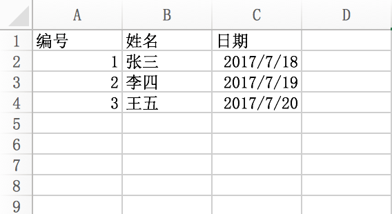

# Excel 处理

## 安装

```
composer require pfinal/excel
```

##  使用示例


### 导入Excel

```
<?php

include 'vendor/autoload.php';

use PFinal\Excel\Excel;

date_default_timezone_set('PRC');

$data = Excel::readExcelFile('./1.xlsx', ['id' => '编号', 'name' => '姓名', 'date' => '日期']);

//处理日期
array_walk($data, function (&$item) {
    $item['date'] = Excel::convertTime($item['date'], 'Y-m-d');
});

var_dump($data);

```

Excel中的数据:



得到结果如下:

```
$data = [
    ['id'=>1,'name'=>'张三', 'date'=>'2017-07-18'],
    ['id'=>1,'name'=>'李四', 'date'=>'2017-07-19'],
    ['id'=>1,'name'=>'王五', 'date'=>'2017-07-20'],
];
```

### 导出到Excel文件


```
$data = array(
    array('id' => 1, 'name' => 'Jack', 'age' => 18, 'date'=>'2017-07-18']),
    array('id' => 2, 'name' => 'Mary', 'age' => 20, 'date'=>'2017-07-18']),
    array('id' => 3, 'name' => 'Ethan', 'age' => 34, 'date'=>'2017-07-18']),
);

$map = array(
    'title'=>[
        'id' => '编号',
        'name' => '姓名',
        'age' => '年龄',
     ],
    'numberFormat' =>array('created_at' => \PHPExcel_Style_NumberFormat::FORMAT_DATE_DDMMYYYY),
);

$file = 'user' . date('Y-m-d');

Excel::exportExcel($data, $map, $file, '用户信息');

```